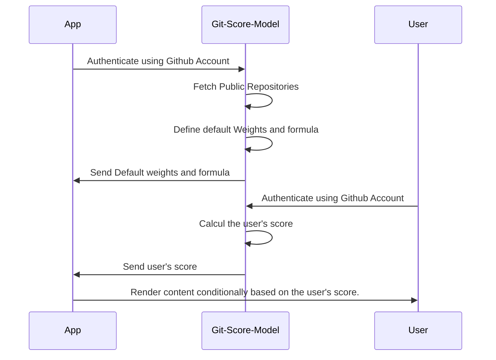

Git-Price-Model is a dynamique Pricing model based on git stats of a given user 



Weights Schema :
``` graphql
  follow : Number,
  sponsor : Number
  repos : { star : Number , fork : Number , contribute : Number }[]
```

## Steps
- Authentication: Authenticate the owner of the app.
- Retrieve Public Repositories: Fetch the public repositories of the owner.
- Configure Weights: Configure weights for different Git stats.
- Configure Formula: Set up the formula to calculate the score based on the weighted Git stats.
- Calculate the Score: Use the configured weights and formula to calculate the score for the user.
- Configure Conditional Rendering: Determine the conditional rendering of the content based on the 


## Repo
### Contributors
```js
import { get_repo_contributors } from "git-score";
const owner = "zakarialaoui10";
const repo = "ziko.js";
get_repo_contributors(owner,repo).then(e=>console.log(e))
```
### Forkers
```js
import { get_repo_forkers } from "git-score";
const owner = "zakarialaoui10";
const repo = "ziko.js";
get_repo_forkers(owner,repo).then(e=>console.log(e))
```
### Languages
```js
import { get_repo_languages } from "git-score";
const owner = "zakarialaoui10"
const repo = "ziko.js"
get_repo_languages(owner,repo).then(e=>console.log(e))
```

## User 
### Repos 
```js
import { get_repo } from "git-score";
const login = "zakarialaoui10";
const options = {
    includeForks : false
}
get_repo(login,options).then(e=>console.log(e))
```
### Sponsoring 
```js
import { get_sponsoring } from "git-score"
get_sponsoring("sindresorhus").then(e=>console.log(e))
```
### Stargazers 
```js
import { get_starred_repos } from "git-score"
get_starred_repos("zakarialaoui10").then(e=>console.log(e))
```
# Score 
## Weights
