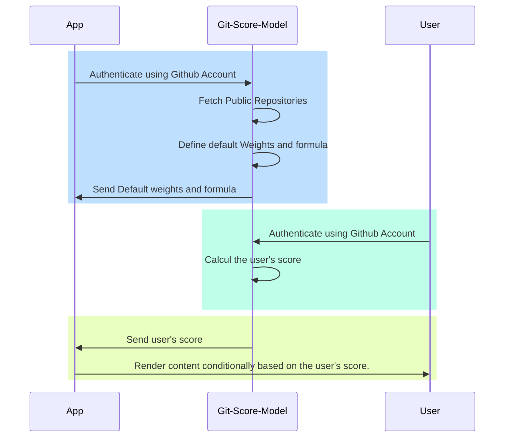

Git-Price-Model is a dynamique Pricing model based on git stats of a given user 



Weights Schema :
``` graphql
  follow : Number,
  sponsor : Number
  repos : { star : Number , fork : Number , contribute : Number }[]
```

## Steps
- Authentication and Data Retrieval :
  * Users authenticate with the GSM using their GitHub accounts.
  * The GSM retrieves data such as the user's public repositories and possibly other relevant Git statistics.
- Score Calculation :
  * Utilizing a predefined formula and weights, the GSM calculates a score representing the user's proficiency, activity level, or contributions within the GitHub community. This score is likely a quantitative measure of the user's impact or involvement.
- Score Transmission :
  * Once the score is calculated, the GSM sends it back to the application.
- Dynamic Content Rendering :
  * The application then utilizes this score to dynamically render content, tailoring the user experience based on their GitHub activity level.

## Repo
### Contributors
```js
import { get_repo_contributors } from "git-score";
const owner = "zakarialaoui10";
const repo = "ziko.js";
get_repo_contributors(owner,repo).then(e=>console.log(e))
```
### Forkers
```js
import { get_repo_forkers } from "git-score";
const owner = "zakarialaoui10";
const repo = "ziko.js";
get_repo_forkers(owner,repo).then(e=>console.log(e))
```
### Languages
```js
import { get_repo_languages } from "git-score";
const owner = "zakarialaoui10"
const repo = "ziko.js"
get_repo_languages(owner,repo).then(e=>console.log(e))
```

## User 
### Repos 
```js
import { get_repo } from "git-score";
const login = "zakarialaoui10";
const options = {
    includeForks : false
}
get_repo(login,options).then(e=>console.log(e))
```
### Sponsoring 
```js
import { get_sponsoring } from "git-score"
get_sponsoring("sindresorhus").then(e=>console.log(e))
```
### Stargazers 
```js
import { get_starred_repos } from "git-score"
get_starred_repos("zakarialaoui10").then(e=>console.log(e))
```
# Score 
## Weights
